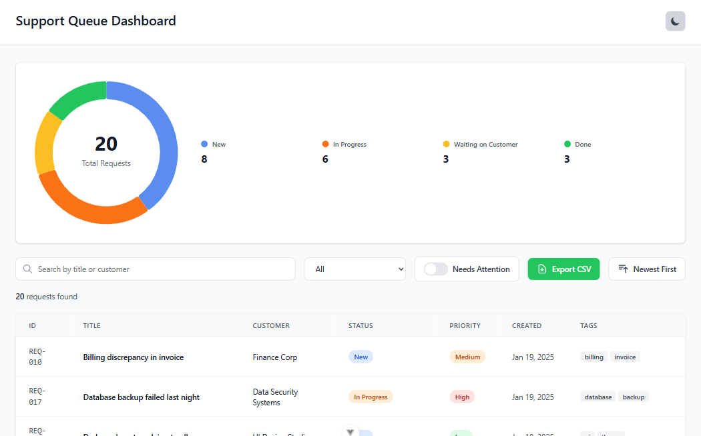
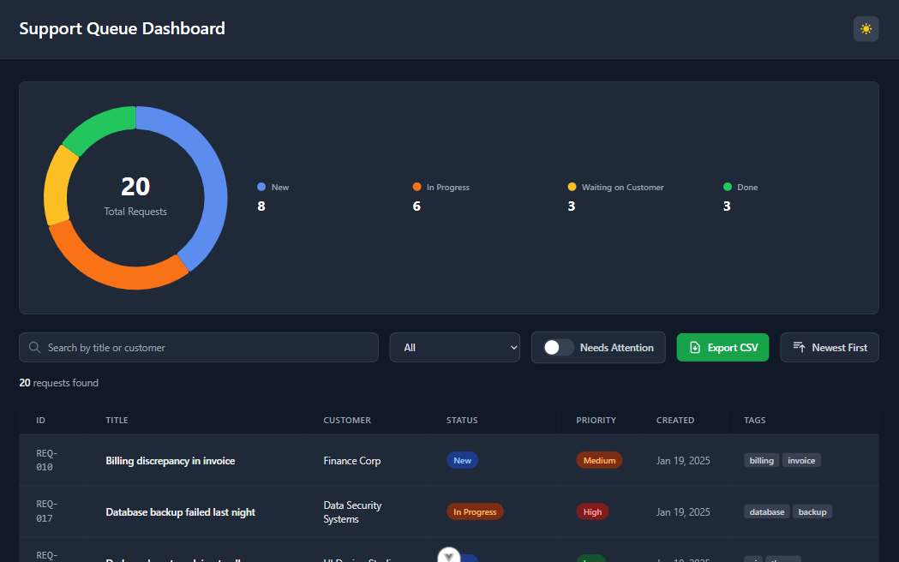

# Orphex Support Queue Dashboard

A Vue 3 application for managing and visualizing support requests with real-time filtering, sorting, and data persistence.


## 🚀 Features

### Core Functionality
- ✅ **Requests List** 
- ✅ **Request Details Modal** 
- ✅ **Needs Attention Logic**
- ✅ **Visual Summary** 
- ✅ **CSV Export** 
- ✅ **Dark/Light Mode**

### Data Integrity Requirement
- **Spread Operator for Sorting** 
- **rray Methods (Filter and Map)** 
- **Computed Properties**
---


### Light Mode


### Dark Mode


---

## 🛠️ Tech Stack

- **Framework:** Vue 3 (Composition API)
- **State Management:** Pinia + pinia-plugin-persistedstate
- **Charts:** Highcharts + highcharts-vue
- **Styling:** Tailwind CSS

---

## 📦 Installation

### Prerequisites
- Node.js 18+ 
- npm or yarn

### Setup
```bash
# Clone repository
git clone https://github.com/kardelen35/orphex-dashboard.git
cd orphex-dashboard

# Install dependencies
npm install

# Run development server
npm run dev

# Build for production
npm run build
```

Visit `http://localhost:5173` in your browser.


## 👤 Author

**Kardelen**
- GitHub: [@kardelen35](https://github.com/kardelen35)

##  Acknowledgments

- Highcharts for the charting library
- Tailwind CSS for the styling framework
- Pinia Store
